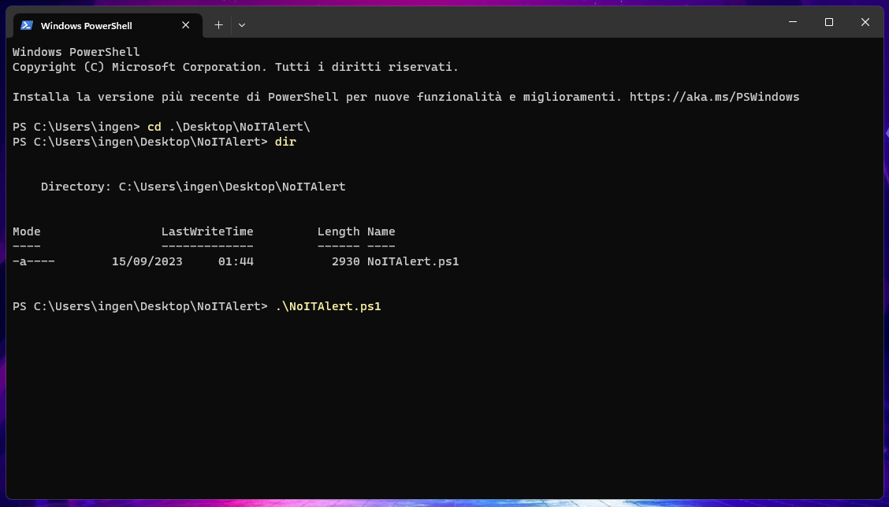

# NoITAlert⛔

Simple PS1 Script that completely removes the pre-installed **"ITAlert"** warning system from **ANY** Android devices.
This script will automatically download the ADB CLI tool, and uninstall all the "ITAlert" packages.
---

# How to use it?🤔

# Step 1: Preparing your Android phone.
Connect your Android device to your PC using a USB cable (Make sure it supports data transfer), and enable the **"USB Debugging"**.
Check the [Android official guide](https://developer.android.com/studio/debug/dev-options) to see how to enable it.

Trust the computer's fingerprint when asked on the phone.
---
# Step 2: Executing.⚙️

* Download the **NoITAlert.ps1** file from the **"Release"** section
* Open a **"Terminal"** or **"Windows Powershell"** tab, navigate to the location where you downloaded the script, and execute it as shown. 
  

## Done!✅ Your phone has now been successfully "purified" from "ITAlert"! 

## Disclaimer:
Non mi assumo alcuna responsabilità dell'utilizzo di tale script.
ITAlert è un sistema di allarme pubblico che potrebbe essere utile in numerose sitazioni di emergenza, e pertanto, ne sconsiglio la disattivazione sui vostri dispositivi.

## Contact

Coded by **@emikodes** - feel free to contact me!
